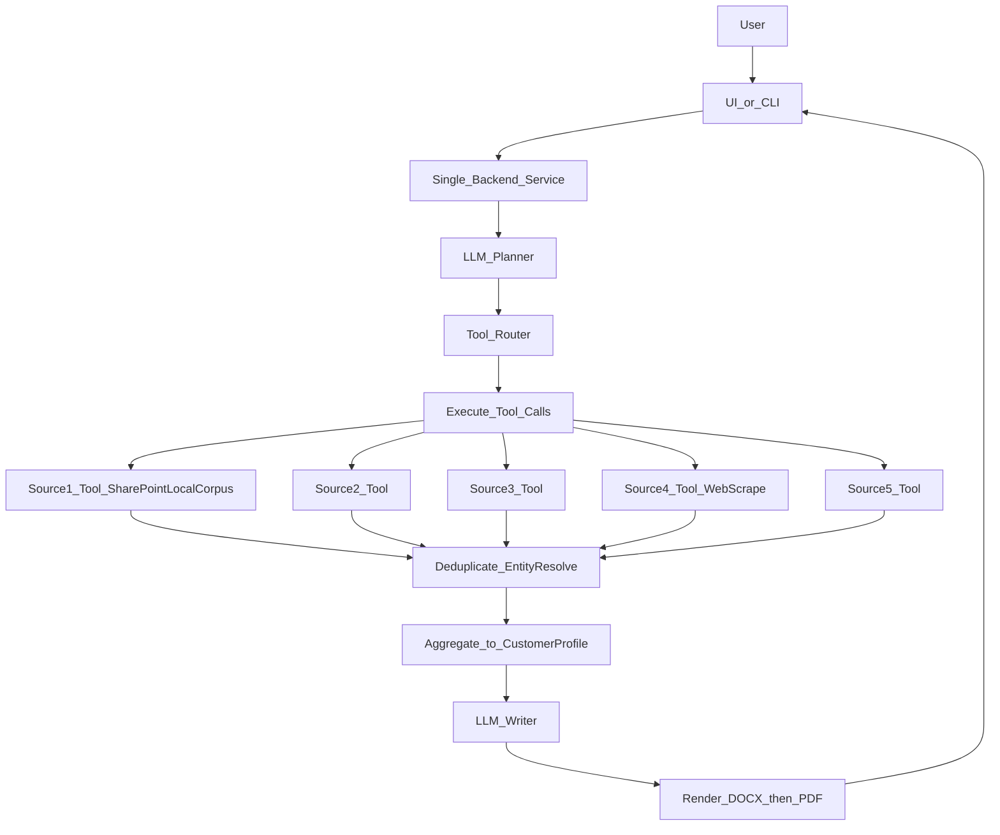

# Agentic Customer Document Generator — MVP-first Architecture (DOCX/PDF)

## Goals

- Accept **free-text user input** describing a customer + what the user wants (e.g., “Create a 1-page account overview and renewal risks for Acme Corp”).
- Fetch customer-related data from **five independent sources** (**Source1–Source5**).
- **Aggregate, reconcile, and validate** information into a unified customer view.
- Generate a **final output document** that answers the user’s ask and includes **source-backed evidence**.
- Generate output as **DOCX and PDF** (DOCX first, then PDF conversion).
- Keep the MVP simple (single service); defer heavy reliability/audit components until needed.

## High-level component diagram




## MVP architecture (start here)

### Modules inside `Single_Backend_Service`

- **LLM_Planner**: produce a strict-JSON `FetchPlan` (what to ask Source1–Source5 for).
- **Tool_Router**: takes the `FetchPlan` and decides the concrete **tool calls** (which tool, with what parameters, in what order; often CRM first, then billing/inventory).
- **Tools (Source1–Source5)**: the “connectors” are implemented as **deterministic tools/functions**. These run in parallel when possible, with per-tool timeouts and limited retries.
  - **MVP (Option A)**: **Source1_Tool_SharePointLocalCorpus** queries the locally available, SharePoint-synced directory (e.g., `LEXI internal PoC`) via filesystem search + file parsing.
  - **Web tool**: **Source4_Tool_WebScrape** extracts structured facts from approved web pages (often reached via `.url` shortcuts found in the corpus).
  - **Later (production, Option B)**: swap **Source1_Tool_SharePointLocalCorpus** with a **SharePointGraph tool** that lists/downloads the same library/folder via Microsoft Graph.
- **Deduplicator / EntityResolver**: resolve customer identity and deduplicate overlapping records across sources before aggregation.
- **Aggregator**: deterministic merge into `CustomerProfile` using precedence rules and conflict notes.
- **LLM_Writer**: generate a structured document outline/content from `CustomerProfile`.
- **Renderer**: render DOCX from a template, then convert DOCX → PDF.
- **Minimal persistence (optional)**: store `job.json` + `output.docx` + `output.pdf`.

### Minimal data contracts

- **FetchPlan**: which sources, queries, and fields to retrieve.
- **SourceResponse**: `{ source, retrieved_at, status, data }`
- **CustomerKeys**: normalized identifiers used for matching (e.g., `{ name?, domain?, account_ids?: {...} }`).
- **CustomerProfile**: unified view (identity + key facts + optional conflicts).

### Web scraping tool (Source4_Tool_WebScrape)

Scraping is implemented as a **tool** (deterministic, guarded), not as an autonomous sub-agent.

- **Input** (conceptual): `{ urls, extraction_schema, allowlist_tag, customer_hint? }`
- **Output (`SourceResponse`)**: `{ source, retrieved_at, status, data }` where `data` includes extracted fields plus evidence metadata (e.g., `url`, `page_title`).

MVP guardrails:

- **Domain allowlist**: only scrape approved domains
- **Robots.txt / terms compliance**: policy decision
- **Rate limiting + backoff**
- **Schema-driven extraction**: extract only what the `extraction_schema` asks for
- **Per-job caching**: avoid re-scraping the same URL within a run

### SharePoint local corpus tool (MVP Option A) — Source1_Tool_SharePointLocalCorpus

This is the MVP replacement for “CRM/Billing/Inventory connectors” while your data lives only in SharePoint.

- **Input** (conceptual): `{ root_dir, query, file_types?, max_results? }`
- **Output (`SourceResponse`)**: `{ source, retrieved_at, status, data }` where `data` includes:\n  - `candidates`: `[ { doc_id, path, kind, title?, url?, score? } ]`\n  - optionally `content` for selected docs (extracted text / parsed fields)

Supported kinds in your current corpus:

- `**.url`**: parse out `URL=...` then hand off to **Source4_Tool_WebScrape** if the planner needs the page content
- (Future) `**.pdf` / `.docx` / `.pptx`**: extract text and return as structured `content`

MVP query behavior:

- Filename/folder keyword match first (fast)
- Optional semantic retrieval later (embeddings) once corpus grows

## Deferred (add later when needed)

- Workflow orchestration / async jobs with state machine.
- Raw evidence store + strict grounding verifier + audit logging.
- Full API gateway + fine-grained authz across sources.
- Full observability stack (tracing/metrics), beyond structured logs.

## Production hardening details (defer until needed)

The sections below are useful once you need stronger reliability, auditability, and governance. For an MVP, implement only the **MVP architecture (start here)** above.

### 1) UI / API Gateway

- **UI_or_CLI**: Collects user input (customer identifiers + doc request) and displays progress.
- **API_Gateway**: Single entrypoint; rate limits; request validation.
- **AuthN_AuthZ**: Enforces who can request what (customer scope + data source permissions).

### 2) Workflow Orchestrator (recommended)

Use a workflow engine pattern so multi-source fetch + generation is robust:

- **Workflow_Orchestrator**: Runs a stateful job with steps, retries, timeouts, and compensation.
- Maintains a **job state machine**:
  - `RECEIVED → PLANNED → FETCHING → AGGREGATING → DRAFTING → VERIFYING → COMPLETED/FAILED`.
- Supports **async execution** (better UX) while still allowing a synchronous “wait for result” option.

### 3) Agent layer (LLM) with guardrails

Split LLM roles to reduce mistakes:

- **LLM_Planner**: Converts user request into a structured plan:
  - Which sources to query
  - Which fields to extract
  - Any constraints (time window, regions, products)
- **Tool_Router**: Enforces a strict tool schema; only allowed connector calls.
- **LLM_Verifier_and_Grounding**: Ensures the final document claims are backed by evidence (citations) and flags ungrounded statements.

Key guardrails:

- Tool schemas with typed inputs/outputs.
- Hard limits: max tokens, max tool calls, max per-source latency.
- “No-evidence, no-claim” policy: every key fact must reference an evidence item.

### 4) Source connectors (Source1–Source5)

Each connector is a thin, testable adapter:

- Handles auth (API keys/OAuth/service accounts), pagination, backoff.
- Produces **Raw Evidence** objects (not “final facts”).
- Normalizes timestamps/IDs.

**Source1–Source5** are placeholders (e.g., CRM, billing, support tickets, usage analytics, contract repository). The architecture treats them uniformly.

### 5) Evidence store (Raw_Evidence_Store)

Append-only storage of:

- Raw responses (or safe subsets)
- Metadata: source, fetch time, query params, confidence, access scope
- Hashes to detect changes

This enables:

- Reproducibility and audits
- Re-generation without refetch (when allowed)
- Debugging incorrect docs

### 6) Normalization and canonical data model

- **Normalize_Map_to_Canonical** maps each source into a shared schema.
- Example canonical entities:
  - `CustomerIdentity` (name, domain, account IDs)
  - `Contract` (term, ARR/MRR, renewal date)
  - `UsageMetric` (period, metric_name, value)
  - `SupportSignal` (ticket count, severity, topics)
  - `FinancialSignal` (invoices, overdue, payment status)

### 7) Entity resolution and reconciliation

When sources disagree, use deterministic reconciliation before the LLM writes:

- **Entity_Resolution_Dedup**: match customers across sources via rules (IDs) + fuzzy match (name/domain) with thresholds.
- **Aggregation_Rules_and_Scoring**:
  - Field-level precedence (e.g., billing system authoritative for payment status)
  - Freshness weighting (newer wins)
  - Conflict flags (“renewal_date_conflict”)

Output:

- `Customer_Profile_View` containing unified facts + evidence pointers + conflict annotations.

### 8) Document composer

- Template-driven and modular:
  - Executive summary
  - Customer overview
  - Key metrics
  - Risks & opportunities
  - Answers to explicit user questions
  - Appendix: citations
- **LLM writes** from the `Customer_Profile_View`, not from raw blobs.
- Output formats:
  - Primary: DOCX
  - Also: PDF (via DOCX → PDF conversion)

### 9) Policy and PII handling

- **Policy_PII_Redaction** applied:
  - At ingestion (mask sensitive fields in raw store)
  - At generation (prevent accidental leakage)
- Access control rules:
  - Per-source scopes
  - Row-level customer scoping
- Data retention policies:
  - Evidence TTL by sensitivity class
  - Audit logs kept longer

### 10) Observability

- End-to-end trace per job (correlation ID).
- Metrics:
  - per-source latency/error rate
  - doc generation time
  - grounding failure rate
- Logs:
  - tool call inputs/outputs (redacted)
  - conflict flags

## End-to-end data flow (step-by-step)

1. **Ingest**: User submits `customer_hint` + `document_request`.
2. **Plan (agentic)**: Planner produces a strict `FetchPlan` (sources + fields + optional time windows).
3. **Fetch in parallel**: Call Source1–Source5 connectors concurrently with per-source timeout and limited retries.
4. **Deduplicate / resolve entity**: Convert `customer_hint` + fetched identifiers into `CustomerKeys`, then deduplicate overlapping entities/records across sources.
5. **Aggregate**: Merge into `CustomerProfile` using deterministic precedence rules; record conflicts/missing data.
6. **Write**: LLM generates document sections from `CustomerProfile`.
7. **Render**: Create DOCX from template, then convert DOCX → PDF.
8. **Publish**: Return both files and list which sources succeeded/failed.

## Example (input → complete flow → output)

### Example input

User provides:

```json
{
  "customer_hint": "Acme Corp",
  "document_request": "Create a 1-page brief from our internal corpus. Find relevant case studies/articles about Acme Corp (or similar) and summarize the key points. Include any risks/notes from the sources."
}
```

### Example planner output (`FetchPlan`)

The `LLM_Planner` converts the free-text request into a tool-oriented plan (conceptual):

```json
{
  "customer_hint": "Acme Corp",
  "tool_calls": [
    {
      "tool": "Source1_Tool_SharePointLocalCorpus",
      "purpose": "corpus_search",
      "query": {
        "root_dir": "LEXI internal PoC",
        "query": "Acme Corp case study interview",
        "file_types": [".url", ".pdf", ".docx"],
        "max_results": 10
      }
    },
    {
      "tool": "Source1_Tool_SharePointLocalCorpus",
      "purpose": "corpus_read",
      "query": { "doc_id": "LEXI internal PoC/Case Studies/DBS Bank – McKinsey Case Study.url" }
    },
    {
      "tool": "Source4_Tool_WebScrape",
      "purpose": "extract_relevant_facts",
      "query": {
        "urls": ["https://www.mckinsey.com/about-us/new-at-mckinsey-blog/an-inside-look-at-how-mckinsey-helped-dbs-become-an-ai-powered-bank?"],
        "extraction_schema": { "key_points": "string[]", "outcomes": "string[]", "quotes": "string[]" }
      }
    }
  ],
  "output_format": ["docx", "pdf"]
}
```

### Example execution trace (what the system does)

1. **Tool routing**
  - `Tool_Router` turns `tool_calls` into concrete calls like `fetch_crm(...)`, `fetch_billing(...)`, `fetch_inventory(...)`.
  - Typical policy: run **Source1_Tool (CRM)** first to anchor identity, then run **Source2/Source3** in parallel using stable IDs.
2. **Tool calls**
  - **Source1_Tool_SharePointLocalCorpus** finds candidate items in `LEXI internal PoC` (filenames/folders, plus parsed `.url` targets).
  - **Source1_Tool_SharePointLocalCorpus** reads a selected `.url` and yields the target URL.
  - **Source4_Tool_WebScrape (Web)** is called only if needed and only for allowlisted URLs/domains; it returns extracted fields with evidence URLs.
3. **Deduplicate / Entity resolve**
  - Combines identifiers discovered across tools into `CustomerKeys`:
    - `crm_account_id`, `billing_account_id`, `domain`, normalized `legal_name`
  - Deduplicates overlaps (e.g., “Acme Corporation” vs “Acme Corp”; parent/child accounts) and produces a single resolved entity plus any `conflicts`.
4. **Aggregate**
  - Builds `CustomerProfile` deterministically:
    - billing facts prefer **Source2_Tool**
    - identity/contact facts prefer **Source1_Tool**
    - entitlements/assets prefer **Source3_Tool**
  - If any tool fails or times out, marks `missing_data` and proceeds.
5. **Write → Render**
  - `LLM_Writer` creates a structured `DocumentSpec` from `CustomerProfile`.
  - `Renderer` outputs:
    - `output.docx` (templated)
    - `output.pdf` (DOCX → PDF conversion)

### Sample output (human-readable representation)

Even though the real artifacts are DOCX/PDF, the content would look like this:

**Title**: Acme Corp — Renewal Brief (Generated 2026-04-20)

**Executive summary**

- Renewal date: 2026-06-30
- Billing status: 2 open invoices (1 overdue)
- Inventory: 3 SKUs active across 2 sites
- Key risks: overdue invoice; entitlement expiry within 90 days

**Customer overview**

- Legal name / domain: Acme Corporation (`acme.com`)
- Primary contacts: Jane Doe (Finance), John Smith (IT)

**Internal corpus highlights (Source1_Tool_SharePointLocalCorpus)**

- Relevant items found: …
- Key excerpts: …

**Extracted facts from web sources (Source4_Tool_WebScrape)**

- Company summary: …
- Recent news (last 30 days): …

**Risks & recommended actions**

- Resolve overdue invoice before renewal discussion.
- Confirm renewal scope for expiring SKU-XYZ.

**Data used**

- Source1_Tool_SharePointLocalCorpus (SharePoint-synced folder): OK, retrieved_at=…
- Source4_Tool_WebScrape (Web): OK, retrieved_at=…
- Source5_Tool: not used

## Reliability & failure modes

- **Partial source failure**: continue if ≥N sources succeed; document includes a “Missing data” section.
- **Stale data**: include last-updated timestamps; optionally refetch.
- **Conflicts**: show conflict list; choose a precedence rule; optionally ask user to pick (future enhancement).
- **Idempotency**: job key = (customer, request_hash, time_window) to safely retry.

## Security model

- Principle of least privilege for each connector.
- Secrets stored in a vault; connectors use short-lived tokens.
- Audit who requested which customer and what sources were queried.

## Deployment shape (reference)

- `api-service` (UI backend)
- `orchestrator-worker` (workflow runner)
- `connectors` (library or separate microservices)
- `storage` (evidence store + document store)
- `llm-service` (proxy with policies, rate limits, caching)

## Minimal viable implementation (MVP)

- Single backend service with:
  - Orchestrated steps in-process
  - Five connectors as modules
  - Canonical model + aggregation rules
  - DOCX output (templated) + PDF conversion

## Scale-out evolution

- Move to workflow engine + worker queue.
- Add caching layer for common customer lookups.
- Add evaluation harness (golden sets) for doc correctness/grounding.

